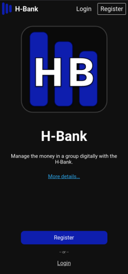
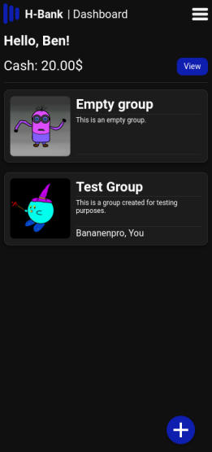
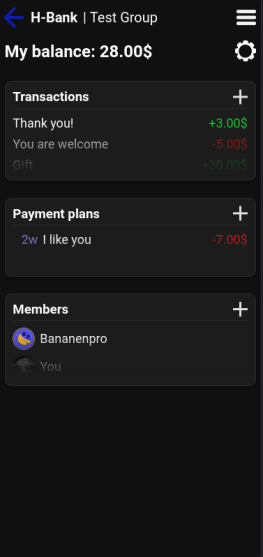
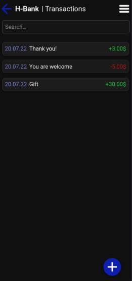
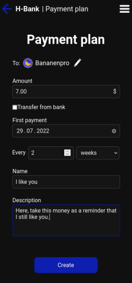

<h1 align="center">H-Bank</h1>


## Description

Digitally manage pocket money in your family.

## Features

- Manage cash and track your expenses
- Join groups to transfer money with other members
- Schedule payment plans for recurring payments
- View all transactions in the transaction log
- Light and dark themes
- Languages: English, German

## Example usage

### Setup

1. One parent creates a group for the family by hitting the *+* icon on the dashboard view
2. Invite all other family members by hitting the *+* icon next to *Members* on the group view
3. Make your husband/wife an admin too by clicking on the up arrow in the members list
4. Second parent: Click on the settings symbol on the group page and hit *leave* next to the *Member: yes* label to leave the group but remain in charge of the bank

### Pocket money

Parent:

1. Hit the *+* symbol next to *Payment plans*
2. Fill out the fields according to your needs. If you wanted to pay your child Ben 30$ on the 1st of every month starting in August 2022, you would enter the following values
  - To: **Ben**
  - Amount: **30**$
  - First payment: **01.08.2022**
  - Every **1** months
  - Name: **Pocket money**
3. Hit *Create*

### Child wants to buy something

Child:

1. Hit the *+* symbol next to *Transactions*
2. Choose *Bank* as a target
3. Enter the desired amount
4. Give the transaction a meaningful title
5. Hit *Transfer*

## Screenshots







## Configuration

H-Bank is looking for configuration in the following locations in order of decreasing precedence: `<working dir>/config.json`, `XDG_CONFIG_HOME/hbank/config.json`.
*Note:* The first config file to be found is used and all others are discarded.

### Default configuration
```jsonc
{
  "debug": false, // !!DO NOT USE IN PRODUCTION!! Disables SameSite for cookies. Returns error messages on HTTP-500 responses.
  "dbVerbose": false, // Prints all sql queries to stdout
  "serverPort": 80, // The port to use for the webserver (if ssl: default = 443)
  "ssl": false, // Enable TLS
  "sslCertPath": "", // Path to TLS cert file
  "sslKeyPath": "", // Path to TLS key file
  "baseURL": "https://hbank.example", // The URL the application is located at
  "emailEnabled": false, // Necessary for email notifications
  "emailHost": "", // SMTP host to use for sending emails
  "emailPort": 0, // SMTP port to use for sending emails
  "emailUsername": "", // Username for SMTP email account
  "emailPassword": "", // Password for SMTP email account
  "minNameLength": 3, // Min length of names like usernames, group names, transaction names, payment plan names, etc.
  "maxNameLength": 30, // Max length of names like usernames, group names, transaction names, payment plan names, etc.
  "minDescriptionLength": 0, // Min length of descriptions like group descriptions, transaction descriptions, payment plan descriptions, etc.
  "maxDescriptionLength": 256, // Max length of names like group descriptions, transaction descriptions, payment plan descriptions, etc.
  "maxProfilePictureFileSize": 10000000, // Max size of uploaded group pictures in bytes
  "maxPageSize": 100, // Max allowed page size for lists
  "idProvider": "", // URL pointing to an OpenID Connect identity provider (must match the issuer value of the provider)
  "clientID": "", // OpenID Connect client ID
  "clientSecret": "", // OpenID Connect client secret
  "devFrontend": "", // URL pointing to frontend dev server (frontend requests will be proxied)
  "frontendDir": "" // Path to static frontend which should be used instead of the default embedded files
}
```

## License

Copyright © 2021-2023 Julian Hofmann

This program is free software: you can redistribute it and/or modify
it under the terms of the GNU Affero General Public License as published
by the Free Software Foundation, either version 3 of the License, or
(at your option) any later version.

This program is distributed in the hope that it will be useful,
but WITHOUT ANY WARRANTY; without even the implied warranty of
MERCHANTABILITY or FITNESS FOR A PARTICULAR PURPOSE.  See the
GNU Affero General Public License for more details.

You should have received a copy of the GNU Affero General Public License
along with this program.  If not, see <https://www.gnu.org/licenses/>.
